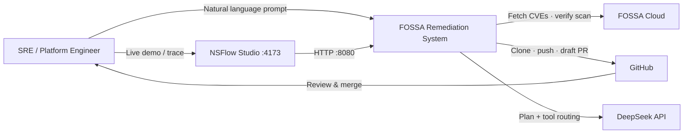
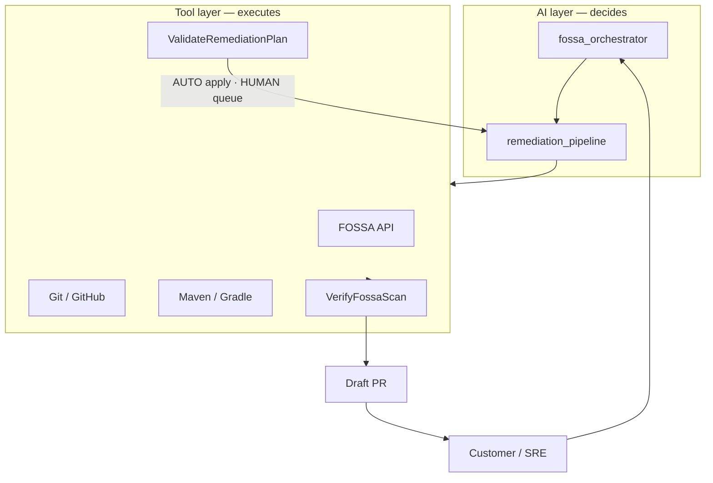
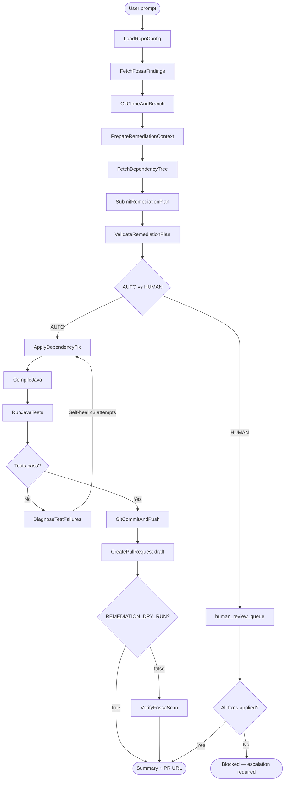
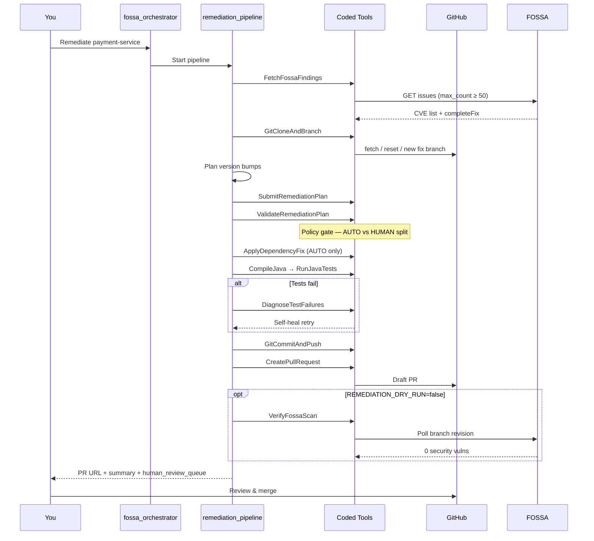
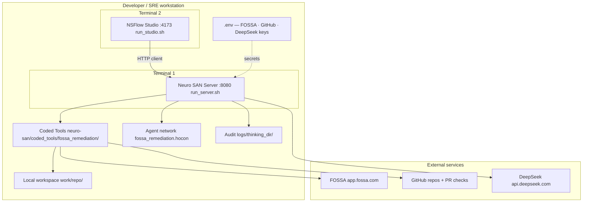

# FOSSA Multi-Agent Remediation POC

Proof-of-concept: **Neuro SAN** runs a remediation pipeline that fetches **FOSSA** findings, plans dependency bumps, applies **AUTO-safe** fixes under policy gates, runs Maven/Gradle tests, and opens **draft PRs** for human review.

Default LLM: **DeepSeek V4 Flash** (`deepseek-v4-flash`). Mistral remains an optional fallback.

Pilot scope: two Spring Boot 21 sample services — **payment-service** (Maven) and **user-service** (Gradle).

## Architecture

### System context



Human-in-the-loop: the pipeline opens **draft PRs only** — SRE reviews and merges.

### Two layers — AI decides, tools execute



The AI proposes version bumps. Python coded tools enforce policy — CVE coverage, FOSSA `completeFix` versions, real compile/test, and no auto-merge.

### Remediation pipeline flow



Policy (`config/remediation_policy.yaml`) splits the plan: **AUTO** actions are applied; **HUMAN** items go to `human_review_queue` and are never auto-applied. Details: [docs/REMEDIATION_POLICY_GATES.md](docs/REMEDIATION_POLICY_GATES.md).

### End-to-end sequence



### Policy gates

| Gate | What it enforces |
|------|------------------|
| **ValidateRemediationPlan** | CVE coverage, FOSSA versions, AUTO/HUMAN split |
| **ApplyDependencyFix** | Re-classifies; refuses non-AUTO actions |
| **RunJavaTests** | No PR when tests fail (self-heal up to 3 attempts) |
| **VerifyFossaScan** | Success only when FOSSA shows 0 security vulns on branch |
| **CreatePullRequest** | Draft PR only — never auto-merge |

### Deployment topology



### Editable diagrams (draw.io)

For slides or architecture reviews, open the C4-style diagrams in [diagrams.net](https://app.diagrams.net):

| File | View | Purpose |
|------|------|---------|
| [docs/diagrams/01-system-context.drawio](docs/diagrams/01-system-context.drawio) | System Context | SRE, system, FOSSA, GitHub, LLM, NSFlow |
| [docs/diagrams/02-containers.drawio](docs/diagrams/02-containers.drawio) | Containers | Agents, policy layer, execution layer |
| [docs/diagrams/03-workflow.drawio](docs/diagrams/03-workflow.drawio) | Workflow | 5 phases + sequence actors |
| [docs/diagrams/04-deployment.drawio](docs/diagrams/04-deployment.drawio) | Deployment | :8080 server, :4173 NSFlow, `.env`, `work/` |

Regenerate after architecture changes: `python scripts/generate_drawio_architecture.py`. More Mermaid slides: [docs/CUSTOMER_DEMO_DIAGRAMS.md](docs/CUSTOMER_DEMO_DIAGRAMS.md).

## Quick start

```bash
# 1. Bootstrap
chmod +x scripts/*.sh
./scripts/setup.sh

# 2. Configure .env
cp .env.example .env
# Required: FOSSA_API_TOKEN, DEEPSEEK_API_KEY, GITHUB_TOKEN
# Optional: MISTRAL_API_KEY (fallback), GITHUB_ORG

# 3. Sample repos + FOSSA (if not already set up)
export GITHUB_ORG=your-github-username
./scripts/bootstrap_sample_repos.sh
# Import in FOSSA — see docs/FOSSA_SETUP.md
python scripts/fetch_fossa_locators.py --write --github-org "$GITHUB_ORG"

# 4. Validate
./scripts/validate_setup.sh
python scripts/dry_run_fossa.py

# 5. Run (two terminals)
./scripts/run_server.sh          # terminal 1 — Neuro SAN HTTP API
./scripts/run_studio.sh          # terminal 2 — NSFlow UI at http://localhost:4173
# Or headless: ./scripts/run_poc.sh
```

### Studio (recommended for demos)

1. Start server + studio as above.
2. Open http://localhost:4173 → select network **`fossa_remediation`**.
3. Paste Sly Data from `logs/nsflow_sly_data.json` (generated by `run_studio.sh`).
4. Chat example:

```
Remediate all FOSSA security vulnerabilities for payment-service.
License issues may be deferred. Do not pass max_count below 50.
```

## What you need

| Item | Purpose |
|------|---------|
| FOSSA API token | Fetch vulnerabilities + completeFix guidance |
| DeepSeek API key | Default LLM (`DEEPSEEK_API_KEY` → `OPENAI_API_KEY` via `scripts/_llm_env.sh`) |
| GitHub PAT | Clone, push branch, open draft PR |
| 2 pilot repos + FOSSA locators | Mapped in `config/repos.yaml` |
| Mistral API key (optional) | Fallback if DeepSeek is unset |
| FOSSA CLI (optional) | Branch scan upload when not dry-running (`brew install fossa`) |

## Project layout

```
config/
  repos.yaml                   # Pilot repo ↔ GitHub ↔ FOSSA ↔ build
  remediation_policy.yaml      # AUTO vs HUMAN classification
  models.yaml                  # Documented model assignments
neuro-san/registries/
  fossa_remediation.hocon      # Agent network + tool wiring
  mistral_llm_info.hocon       # DeepSeek (+ optional Mistral) model registry
neuro-san/coded_tools/fossa_remediation/
  fetch_fossa_findings.py      # FOSSA Issues API (min max_count=50)
  remediation_policy.py        # Policy load + classify
  apply_dependency_fix.py      # Apply AUTO bumps only
  validate_remediation_plan.py # Plan validation + Mode B split
  git_ops.py / java_build.py / github_pr.py / verify_fossa_scan.py
  diagnose_test_failures.py    # Self-heal after test failures
scripts/
  run_server.sh / run_studio.sh / run_poc.sh
  dry_run_fossa.py / validate_setup.sh / build_sly_data.py
docs/
  DEMO_SCRIPT.md               # Leadership demo
  REMEDIATION_POLICY_GATES.md  # Policy Mode B
  FOSSA_SETUP.md               # Sample repo + FOSSA onboarding
  CUSTOMER_DEMO_DIAGRAMS.md    # Mermaid slides for customer demos
  diagrams/                    # draw.io C4 architecture (system, containers, workflow, deployment)
sample-repos/                  # payment-service + user-service sources
```

## Demo prompts

**Single repo (payment-service):**

```
Remediate all FOSSA security vulnerabilities for payment-service.
License issues may be deferred. Do not pass max_count below 50.
```

**All configured pilots:**

```
Remediate critical and high FOSSA vulnerabilities for all configured pilot repos.
Open draft PRs only. Summarize PR links, test results, and any human_review_queue items.
```

## Guardrails

- Draft PRs only — no merge, no Cloud Run deploy
- Secrets in `.env` / sly_data — never in agent prompts
- `ValidateRemediationPlan` + `ApplyDependencyFix` enforce AUTO/HUMAN policy
- Major bumps require human approval unless listed under `allow_major_bump` (e.g. `org.yaml:snakeyaml` for Spring Boot 3)
- FOSSA branch verify gate when `REMEDIATION_DRY_RUN=false` (expects 0 security vulns)
- Fresh timestamped fix branch from `main` when `FOSSA_FRESH_BRANCH=true`

## Environment knobs

| Variable | Default | Meaning |
|----------|---------|---------|
| `DEEPSEEK_API_KEY` | — | Primary LLM key |
| `REMEDIATION_LLM_MODEL` | `deepseek-v4-flash` | Override model |
| `REMEDIATION_LLM_FALLBACK` | unset | Optional second model (e.g. `deepseek-v4-pro`) |
| `REMEDIATION_DRY_RUN` | often `true` in Studio | Skip FOSSA branch verify before PR |
| `REMEDIATION_OSV_LOOKUP_ENABLED` | `false` | OSV only when FOSSA says `NO_SAFE_VERSION` |
| `FOSSA_FRESH_BRANCH` | `true` | New branch from `origin/main` each run |

## Troubleshooting

| Issue | Fix |
|-------|-----|
| `FOSSA_API_TOKEN is not set` | Fill `.env` |
| DeepSeek / OpenAI auth errors | Set `DEEPSEEK_API_KEY`; scripts map it to `OPENAI_API_KEY` + `https://api.deepseek.com` |
| Truncated findings / missing SnakeYAML | Ensure fetch uses `max_count` ≥ 50 (tool clamps below 50) |
| SnakeYAML blocked as HUMAN / TagInspector test fail | Confirm `allow_major_bump` for `org.yaml:snakeyaml` in policy; restart server after policy edits |
| `YOUR_ORG_ID` / bad locator in repos.yaml | Run `fetch_fossa_locators.py --write` |
| Studio can't reach server | Start `./scripts/run_server.sh` first; health URL uses port `8080` |
| Tests fail after bump | Pipeline self-heals via `DiagnoseTestFailures`; inspect `work/<repo>` |
| Policy unit tests | `python tests/test_remediation_policy.py` |

## References

- [Neuro SAN](https://github.com/cognizant-ai-lab/neuro-san)
- [FOSSA Issues API](https://docs.fossa.com/docs/issues-api-configuration)
- [FOSSA Remediation Guidance](https://docs.fossa.com/docs/remediation-guidance)
- [DeepSeek API](https://api-docs.deepseek.com/)
- [docs/DEMO_SCRIPT.md](docs/DEMO_SCRIPT.md) · [docs/REMEDIATION_POLICY_GATES.md](docs/REMEDIATION_POLICY_GATES.md) · [docs/FOSSA_SETUP.md](docs/FOSSA_SETUP.md)
