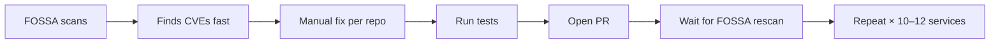
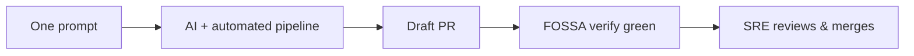
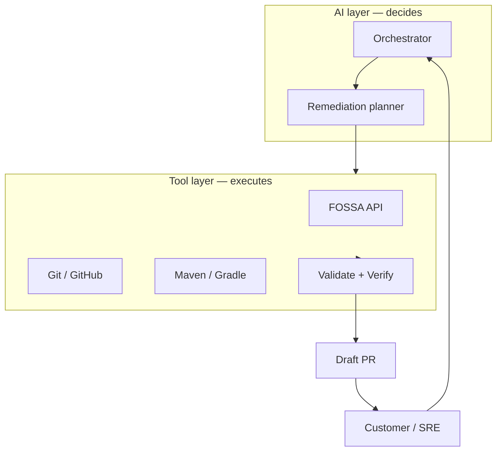
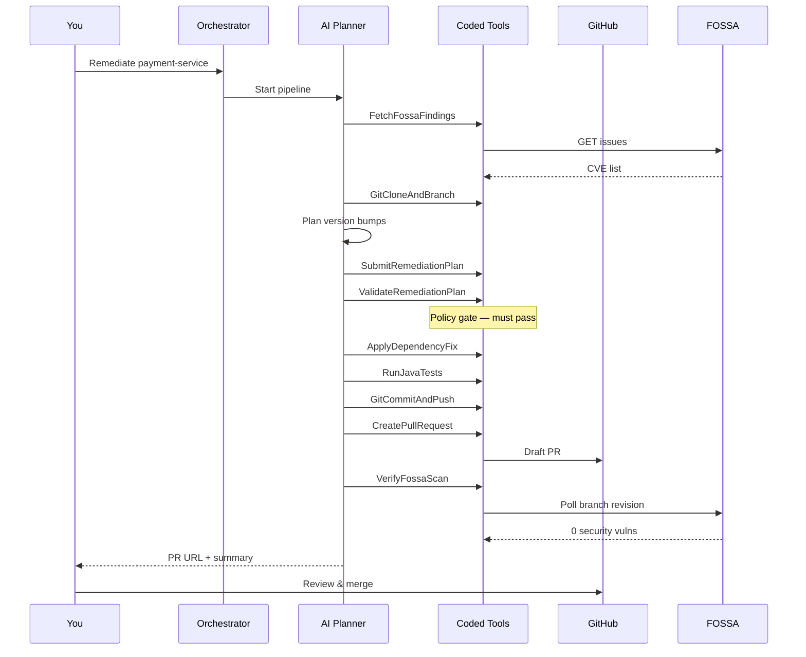

# FOSSA Auto-Remediation — Customer Demo Diagrams

Use these in PowerPoint, Google Slides, or Mermaid Live Editor.  
For an **interactive** walkthrough, open the Canvas beside chat:

[fossa-demo-explainer](/Users/preetampotadar/.cursor/projects/Users-preetampotadar-fossa-multi-agent/canvases/fossa-demo-explainer.canvas.tsx)

---

## Slide 1 — The problem (30 seconds)

**Talk track:** FOSSA is good at finding issues. The bottleneck is doing the same dependency bump → test → PR → verify cycle every month across many microservices.

---

## Slide 2 — The solution (30 seconds)

**Talk track:** One sentence in, draft PR out — with tests run and FOSSA Security Analysis verified before we call it success.

---

## Slide 3 — Two layers (most important for customers)

**Talk track:** The AI proposes fixes. Python tools enforce policy — every CVE covered, FOSSA-approved versions only, real tests, no auto-merge.

---

## Slide 4 — Full workflow (5 phases)

---

## Slide 5 — Policy gates (trust slide)

| Gate | What it blocks |
|------|----------------|
| **ValidateRemediationPlan** | Skipping CVEs, wrong versions, deferring security issues |
| **RunJavaTests** | Opening PR when tests fail |
| **VerifyFossaScan** | Success when FOSSA still shows security vulns on branch |
| **CreatePullRequest** | Auto-merge (draft PR only) |

---

## Slide 6 — What to show live (demo script)

| Order | Show | Say |
|-------|------|-----|
| 1 | NSFlow — select `fossa_remediation` | "This is the agent network" |
| 2 | Paste Sly Data JSON | "Session config — dry run, API routing" |
| 3 | Send prompt | "One sentence starts the pipeline" |
| 4 | Agent Communications | "Watch tools run — FOSSA, validate, apply, test" |
| 5 | GitHub draft PR | "Human review required — never auto-merge" |
| 6 | FOSSA / PR Security Analysis | "Same check your team already trusts" |

---

## Slide 7 — Before vs after

| | Before (manual) | After (this POC) |
|--|-----------------|------------------|
| Trigger | Engineer per repo | One prompt per repo |
| Version choice | Manual research | FOSSA + validated plan |
| Tests | Manual | Automated same CI command |
| PR | Manual | Draft PR with CVE summary |
| FOSSA rescan | Wait & check UI | Automated verify gate |
| Audit | Spreadsheets / memory | NSFlow + logs + validation output |

---

## Recording a short video (you — not AI-generated)

I cannot generate video files. Fastest path for a 3–5 minute customer clip:

1. **Loom** or **QuickTime screen record**
2. Terminal 1: `./scripts/run_server.sh`
3. Terminal 2: `./scripts/run_studio.sh` → open http://localhost:4173
4. Narrate using the Canvas steps (link above) while NSFlow runs
5. Cut to GitHub draft PR + FOSSA green check at the end

**Structure:** Problem (30s) → One prompt (30s) → Tool trace (90s) → PR + verify (60s) → Human merge (30s)
