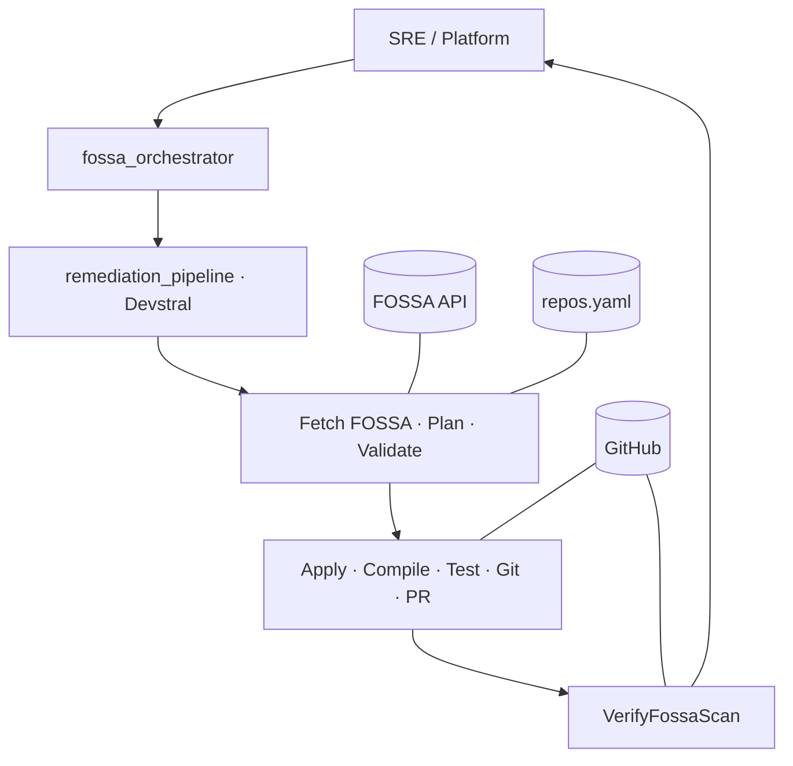
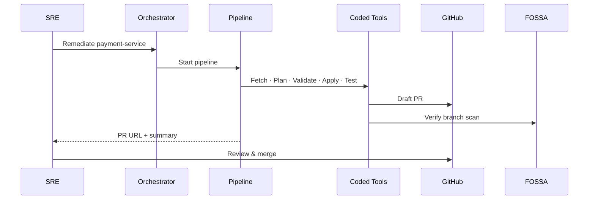

# FOSSA Multi-Agent Remediation — Executive 2-Pager

**File:** `docs/FOSSA_Remediation_Executive_2Pager.pptx` (2 slides · print or PDF as 2 pages)  
**Regenerate:** `python scripts/generate_executive_2pager.py`

---

## Page 1 — Problem + Architecture

### Manual vs multi-agent

### System architecture

---

## Page 2 — Workflow + Governance

### 5-phase workflow

### Policy gates

| Gate | Blocks |
|------|--------|
| ValidateRemediationPlan | Wrong versions, skipped CVEs |
| RunJavaTests | PR when tests fail |
| VerifyFossaScan | Success with open security vulns |
| CreatePullRequest | Auto-merge (draft only) |

### Sequence

