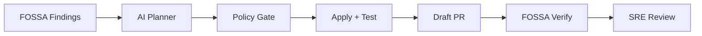

# FOSSA Multi-Agent Remediation — Leadership & Customer Presentation

**Format:** 12 slides · ~15 minutes · Copy each slide block into PowerPoint  
**Audience:** Leadership + customer security / platform engineering  
**POC status:** End-to-end run validated (FOSSA → fix → test → draft PR → verify)

---

## Slide 1 — Title

**FOSSA Multi-Agent Remediation**  
*Automated vulnerability remediation with human-in-the-loop governance*

- Proof of concept: Neuro SAN + Mistral Devstral + FOSSA + GitHub
- Pilot scope: Spring Boot microservices (`payment-service`, `user-service`)
- Outcome: Draft PR with dependency fixes, tests, and FOSSA Security Analysis alignment

**Speaker note:** This is a working POC, not a slide-deck concept. We can run it live or show a recorded run.

---

## Slide 2 — The Problem

**Monthly FOSSA remediation does not scale with manual effort**

| Pain | Impact |
|------|--------|
| 10–12+ microservices per FOSSA cycle | Days of engineer time across teams |
| Repetitive dependency bumps (Maven/Gradle) | Same CVE patterns, different repos |
| FOSSA findings ≠ merged fixes | Dashboard green only after someone opens a PR |
| Test + CI validation | Every bump needs build verification before merge |
| Compliance pressure | Security findings must be closed; licensing may be triaged |

**Bottom line:** Security teams find issues fast; **remediation throughput** is the bottleneck.

---

## Slide 3 — Why Not “Just FOSSA” or “Just an LLM”?

| Approach | Gap |
|----------|-----|
| FOSSA alone | Finds and recommends — does not clone, test, and open PRs in your CI |
| Single coding agent | No policy gates; can hallucinate versions or skip CVEs |
| Manual SRE runbooks | Does not scale; knowledge trapped in tribal process |

**We need:** orchestrated workflow + **deterministic guardrails** + auditable tool execution.

---

## Slide 4 — Our Solution (One Sentence)

**An AI-orchestrated remediation pipeline that reads FOSSA findings, plans fixes, validates policy, applies changes, runs tests, opens a draft PR, and verifies FOSSA Security Analysis — with humans reviewing before merge.**



---

## Slide 5 — Architecture (What We Built)

**Two-layer design: LLM decides · Python enforces**

| Layer | Component | Role |
|-------|-----------|------|
| **Entry** | `fossa_orchestrator` | Receives natural-language request; delegates to pipeline |
| **Brain** | `remediation_pipeline` (Mistral Devstral) | Plans version bumps; chooses tools; drafts PR text |
| **Hands** | 17 **Coded Tools** (Python) | FOSSA API, git, Maven/Gradle tests, GitHub PR — no secrets in LLM chat |
| **Gates** | `ValidateRemediationPlan` | All security CVEs covered; versions trace to FOSSA/OSV |
| **Gates** | `VerifyFossaScan` | Zero security vulns on GitHub-imported FOSSA project before success |

**Config-driven:** `config/repos.yaml` + `fossa_remediation.hocon` — add repos without redeploying agent logic.

---

## Slide 6 — End-to-End Workflow

**One command → draft PR**

1. **Discover** — Load repo config; fetch FOSSA vulnerabilities (+ licensing context)
2. **Clone** — Fresh fix branch (`fix/fossa-auto-…`); never touch `main`
3. **Plan** — LLM proposes bumps; **ValidateRemediationPlan** enforces policy
4. **Apply** — Edit `pom.xml` / `build.gradle` from validated plan only
5. **Test** — `./mvnw test` or `./gradlew test`; self-heal up to 3 rounds on failure
6. **Ship** — Commit, push, open **draft PR** (triggers GitHub FOSSA App scan)
7. **Verify** — Poll FOSSA until **0 security vulnerabilities** on branch revision
8. **Report** — PR URL + summary for SRE review

**Policy:** Security findings must be fixed · Licensing may be deferred · Draft PR only · No auto-merge

---

## Slide 7 — Implementation Highlights

**Technology stack**

| Area | Choice |
|------|--------|
| Orchestration | [Neuro SAN](https://github.com/cognizant-ai-lab/neuro-san) (multi-agent HOCON network) |
| LLM | Mistral **Devstral** (`labs-devstral-small-2512`) via OpenAI-compatible API |
| Security data | FOSSA Issues API v2; GitHub-imported project (`git+github.com/…`) |
| Fix validation | FOSSA `completeFix` / OSV fallback for `NO_SAFE_VERSION` |
| SCM / CI | GitHub PAT; existing Maven/Gradle test commands |
| Demo UI | Neuro SAN Studio (NSFlow) at `localhost:4173` for live traceability |

**Pilot repos:** `payment-service` (Maven), `user-service` (Gradle) — Spring Boot 21

---

## Slide 8 — Governance & Safety (Enterprise-Ready Posture)

| Guardrail | How |
|-----------|-----|
| No auto-merge | Draft PR only; SRE approves |
| No secret leakage | Tokens in `.env`; FOSSA/GitHub via coded tools |
| Version integrity | Plan must match FOSSA-allowed versions; Maven Central check |
| Full CVE coverage | Cannot defer security findings; licensing-only deferrals |
| FOSSA truth | Verify uses **GitHub FOSSA App** project — same as PR Security Analysis check |
| Audit trail | Server logs, agent thinking files, NSFlow agent communications |
| CI unchanged | Same test commands as today; PR triggers existing pipelines |

---

## Slide 9 — Demo (Live or Recorded)

**Trigger (natural language):**
> *Remediate all FOSSA security vulnerabilities for payment-service. License issues may be deferred.*

**What to show**

1. **Console / NSFlow** — Live tool steps: Fetch FOSSA → Validate plan → Apply → Test → PR
2. **GitHub** — Draft PR with dependency diff and CVE summary
3. **FOSSA** — Branch revision; Security Analysis green after verify
4. **Traceability** — `ValidateRemediationPlan` output listing each bump and CVE

**Run commands**
```bash
./scripts/run_server.sh          # Terminal 1
./scripts/run_poc.sh "..."       # Terminal 2 — or NSFlow :4173
```

---

## Slide 10 — Results (POC)

**Demonstrated capabilities**

- Automated multi-CVE remediation on real GitHub repo (`payment-service`)
- Rule-based + LLM planning with **policy gate** before file changes
- Tests passing before PR opened
- Draft PR created; FOSSA verify aligned with GitHub Security Analysis
- End-to-end run ~15–20 minutes (FOSSA scan wait dominates)

**Efficiency signal**

| Today (manual) | With agent (POC) |
|----------------|------------------|
| Engineer hours per repo | One prompt + SRE review |
| 2 repos sequential | Architecture supports **parallel** repos |
| Tribal knowledge | Config + HOCON workflow |

---

## Slide 11 — Scale Path (Phase 2)

| POC (now) | Production target |
|-----------|-------------------|
| 2 pilot repos | 12+ microservices |
| Manual trigger (`run_poc.sh` / NSFlow) | Monthly scheduler or FOSSA webhook |
| Draft PR + verify | Same + Slack/email summary to SRE |
| Local / dev server | GCP Cloud Run Job wrapper |
| Agent thinking logs | Centralized audit + metrics dashboard |

**Business value:** FOSSA cycle from **days → hours**; engineers focus on review, not repetitive bumps.

---

## Slide 12 — Ask & Next Steps

**For customer**

1. Confirm pilot repos + FOSSA GitHub import locators
2. Provide GitHub PAT scope (`contents`, `pull_requests`) and FOSSA API token
3. Align on policy: draft PR only; licensing deferral rules; required CI gates

**For leadership**

- Approve Phase 2: parallel 12-repo run + scheduled remediation
- Sponsor SRE review workflow integration (Slack, Jira, ServiceNow)

**Closing line:**  
*We turned FOSSA findings into reviewed, test-passing, FOSSA-verified draft PRs — with policy enforced in code, not prompts alone.*

---

## Appendix — Q&A Cheat Sheet

**Why Neuro SAN vs one agent?**  
Separation of orchestration, planning, and deterministic tools. HOCON workflow editable without Python redeploy.

**Why not FOSSA bot alone?**  
FOSSA excels at detection. We add cross-repo orchestration, Java build/test, custom deferral policy, and PR workflow.

**Is the LLM trusted for versions?**  
No — `ValidateRemediationPlan` enforces FOSSA/OSV-sourced versions and full vulnerability coverage.

**What if tests fail?**  
Self-heal loop (diagnose → test-fix plan → re-test, max 3 attempts); no PR if tests still fail.

**Cost?**  
Devstral for planning/tool routing; token usage ~300K per full run; FOSSA/GitHub API at normal rates.

**Safe for production?**  
POC is draft-PR-only. Phase 2 adds approval gates, rate limits, and centralized logging.

---

## Suggested PowerPoint Visuals (per slide)

| Slide | Visual |
|-------|--------|
| 4 | Simple left-to-right pipeline arrow |
| 5 | Box diagram: Orchestrator → Pipeline → Coded Tools → Gates |
| 6 | Numbered vertical timeline (8 steps) |
| 8 | Checkmark table (guardrails) |
| 9 | Screenshot placeholders: NSFlow, GitHub PR, FOSSA check |
| 11 | 2-column “Today vs Target” table |

*Optional screenshot sources: NSFlow Agent Communications tab, GitHub draft PR, FOSSA Security Analysis check.*
